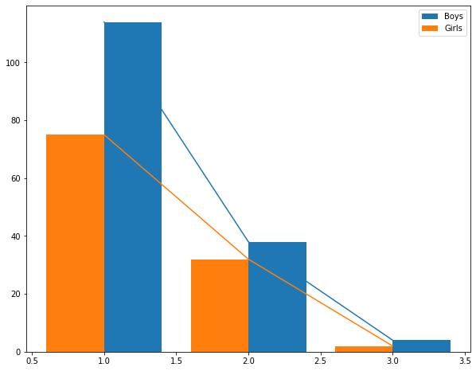
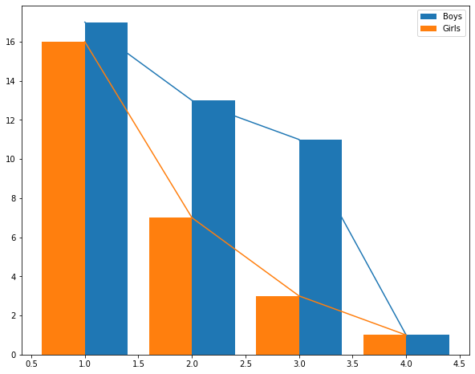

---
jupyter:
  colab:
    name: Exploration.ipynb
  kernelspec:
    display_name: Python 3
    name: python3
  language_info:
    name: python
  nbformat: 4
  nbformat_minor: 0
---

::: {.cell .markdown id="k2kgkszNYuRU"}
\#Gender-classification-for-jobs
:::

::: {.cell .markdown id="DyZLRqFZY8Hc"}
the dataset has been taken from placement cell mails and for privacy
reasons all its processing code and data has been stored in
[Gender-classification-for-jobs.zip](Gender-classification-for-jobs.zip)
with a password contact admins for the password
:::

::: {.cell .markdown id="6C2Gy1YgZYmZ"}
the dataset consisted of names of students who passed through each round
we data from four companies as such and cleaned it so it only has names
in it and using the name
[LSTMClassifier_IndianNames.ipynb](LSTMClassifier_IndianNames.ipynb)
model we trained and and model weights and training dataset are public
we used the model to classify the names into male and female the model
had an accuracy of 90% on 50 epochs
:::

::: {.cell .markdown id="aXsCJCTsaLDI"}
Then we took the classifed gender and summarized it into number of male
and females in a single round then we reformatted it array has each
company in array and in that 2 subarray one for male other for female
numbers in each rounds that data is stored in
[GenderDataPublic.pkl](GenderDataPublic.pkl)
:::

::: {.cell .code execution_count="5" id="I4QfSMRBXh4q"}
``` {.python}
import pickle
import matplotlib as mpl
mpl.rcParams['figure.figsize'] = (10,8)
mpl.rcParams['axes.grid'] = False
import matplotlib.pyplot as plt
```
:::

::: {.cell .code execution_count="3" id="UPaHfOT9bSjX"}
``` {.python}
with open("GenderDataPublic.pkl","rb") as f:
  data = pickle.load(f)
```
:::

::: {.cell .code execution_count="4" colab="{\"base_uri\":\"https://localhost:8080/\"}" id="5rMGcJ4Jbo7H" outputId="1c8096eb-1c45-436d-ba02-47af4e430b39"}
``` {.python}
data
```

::: {.output .execute_result execution_count="4"}
    [[[23, 11, 2], [47, 26, 7]],
     [[75, 32, 2], [114, 38, 4]],
     [[16, 7, 3, 1], [17, 13, 11, 1]],
     [[134, 3], [232, 9]]]
:::
:::

::: {.cell .markdown id="i26SlBHjgwxx"}
we calculate the likelyhood to goto next round as -100/slope it is
calculated for each round and stored in array which is later used to
show likelyhood
:::

::: {.cell .code execution_count="19" id="M4nL_pwNdT_s"}
``` {.python}
def slope(y):
  x = [i for i in range(1,len(y)+1)]
  m = []
  for i in range(1,len(y)):
    dm = (y[i]-y[i-1])/(x[i]-x[i-1])
    m.append(round(100/(abs(dm)+0.0001),2))
  return m
```
:::

::: {.cell .code execution_count="25" id="A29KCkFKbqlT"}
``` {.python}
def plot(company):
  global data
  f = data[company][0]
  m = data[company][1]
  labels = [i for i in range(1,len(data[company][0])+1)]
  plt.bar(labels,m,align="edge",width=0.4,label="Boys")
  plt.bar(labels,f,align="edge",width=-0.4,label="Girls")
  plt.plot(labels,m)
  plt.plot(labels,f)
  plt.legend(loc='upper right')
  print("the likelyhood score for each round are as follows : \n", {'Boys':slope(m),'Girls':slope(f)})
```
:::

::: {.cell .code execution_count="26" colab="{\"height\":519,\"base_uri\":\"https://localhost:8080/\"}" id="zyIa3W3vc3l6" outputId="09d73ebd-edfd-4b4d-b1fb-60a119f46086"}
``` {.python}
plot(0)
```

::: {.output .stream .stdout}
    the likelyhood score for each round are as follows : 
     {'Boys': [4.76, 5.26], 'Girls': [8.33, 11.11]}
:::

::: {.output .display_data}

:::
:::

::: {.cell .code execution_count="27" colab="{\"height\":519,\"base_uri\":\"https://localhost:8080/\"}" id="HVVyGxLhf8zu" outputId="c7f6c582-711b-4377-9fe1-33c417ace4a4"}
``` {.python}
plot(1)
```

::: {.output .stream .stdout}
    the likelyhood score for each round are as follows : 
     {'Boys': [1.32, 2.94], 'Girls': [2.33, 3.33]}
:::

::: {.output .display_data}

:::
:::

::: {.cell .code execution_count="28" colab="{\"height\":519,\"base_uri\":\"https://localhost:8080/\"}" id="jzTxw40kgAjP" outputId="62e869a2-72a0-4894-f638-6a75ff817464"}
``` {.python}
plot(2)
```

::: {.output .stream .stdout}
    the likelyhood score for each round are as follows : 
     {'Boys': [25.0, 50.0, 10.0], 'Girls': [11.11, 25.0, 50.0]}
:::

::: {.output .display_data}

:::
:::

::: {.cell .code execution_count="29" colab="{\"height\":519,\"base_uri\":\"https://localhost:8080/\"}" id="qkuH6B5ugLun" outputId="9dd7277e-c77e-4d73-f5a1-b1a76c8e7dd3"}
``` {.python}
plot(3)
```

::: {.output .stream .stdout}
    the likelyhood score for each round are as follows : 
     {'Boys': [0.45], 'Girls': [0.76]}
:::

::: {.output .display_data}

:::
:::

::: {.cell .markdown id="PEnVBOkUhJgE"}
\#Conclusion : Boys are less likely to get through the last rounds than
women which usually are interview and HR rounds but boys are more likely
sometimes in the earlier rounds
:::
