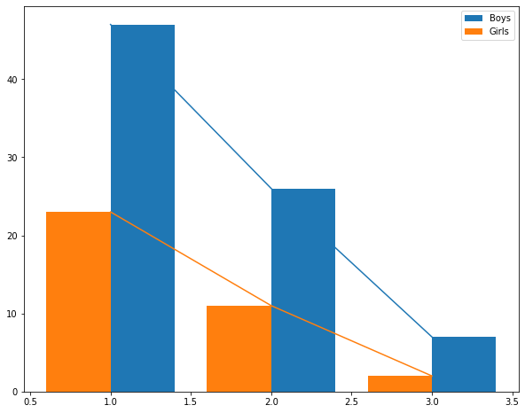
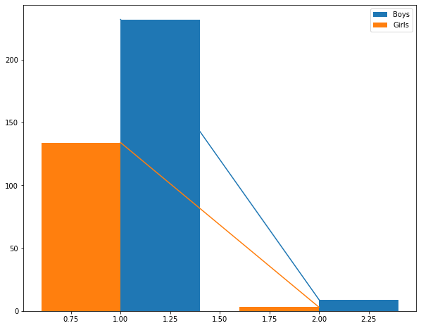

# Gender-classification-for-jobs

the dataset has been taken from placement cell mails and for privacy
reasons all its processing code and data is in a private repo

the dataset consisted of names of students who passed through each round
we data from four companies as such and cleaned it so it only has names
in it and using the name
[LSTMClassifier_IndianNames.ipynb](LSTMClassifier_IndianNames.ipynb)
model we trained and and model weights and training dataset are public
we used the model to classify the names into male and female the model
had an accuracy of 90% on 50 epochs

Then we took the classifed gender and summarized it into number of male
and females in a single round then we reformatted it array has each
company in array and in that 2 subarray one for male other for female
numbers in each rounds that data is stored in
[GenderDataPublic.pkl](GenderDataPublic.pkl)

``` {.python}
data
```

    [[[23, 11, 2], [47, 26, 7]],
    
     [[75, 32, 2], [114, 38, 4]],
    
    [[16, 7, 3, 1], [17, 13, 11, 1]],
    
    [[134, 3], [232, 9]]]


we calculate the likelyhood to goto next round as -100/slope it is
calculated for each round and stored in array which is later used to
show likelyhood

``` {.python}
plot(0)
```

    the likelyhood score for each round are as follows : 
     {'Boys': [4.76, 5.26], 'Girls': [8.33, 11.11]}




``` {.python}
plot(1)
```

    the likelyhood score for each round are as follows : 
     {'Boys': [1.32, 2.94], 'Girls': [2.33, 3.33]}


``` {.python}
plot(2)
```

    the likelyhood score for each round are as follows : 
     {'Boys': [25.0, 50.0, 10.0], 'Girls': [11.11, 25.0, 50.0]}


``` {.python}
plot(3)
```

    the likelyhood score for each round are as follows : 
     {'Boys': [0.45], 'Girls': [0.76]}
 


# Conclusion : 
Boys are less likely to get through the last rounds than

Girls are which usually are interview or HR rounds 
but Boys are more likely **sometimes** in the earlier rounds

